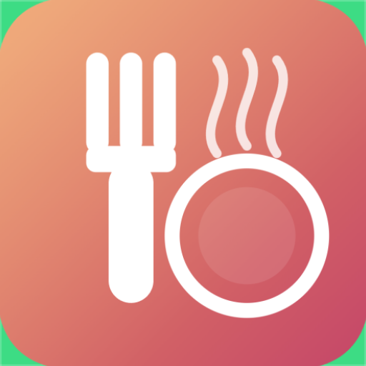

<p align="center">
  
</p>

<h1 align="center">MealPlanner</h1>

<p align="center">
  App Android para planificar comidas semanales, generar listas de la compra y descubrir recetas nuevas con IA.
</p>

---

## Funcionalidades

- 🍽️ **Recetario personal** — crea, edita y elimina recetas con ingredientes, cantidades, pasos de preparación, tiempo estimado y categoría (desayuno, almuerzo, cena, snack, postre).
- 📅 **Plan semanal de comidas** — asigna recetas a almuerzo/cena de cada día de la semana, navega entre semanas y rellena espacios vacíos automáticamente al azar.
- 🛒 **Lista de la compra automática** — se genera consolidando los ingredientes de todas las recetas planificadas para la semana, agrupados por categoría de supermercado (verduras, frutas, carnes, lácteos, congelados, despensa, condimentos, bebidas).
- 💰 **Comparador de precios Mercadona** — estima el coste de tu lista de la compra buscando los productos equivalentes en el catálogo de Mercadona, con alternativas sugeridas por producto.
- 🤖 **Sugerencias de recetas con IA** — describe los ingredientes que tienes disponibles y tus preferencias, y recibe sugerencias de recetas generadas por OpenAI o Gemini, listas para guardar en tu recetario.
- 📥 **Importar recetas** — desde texto libre, imagen (foto de una receta) o archivo Excel, usando IA para extraer y estructurar los datos automáticamente.
- 💾 **Backup y restauración** — exporta e importa toda tu base de datos (recetas, ingredientes, plan de comidas) para no perder tu información.
- 🔐 **Inicio de sesión con Google** — autenticación vía Firebase Auth.
- 🌍 **Multi-idioma** — español e inglés.
- 🎨 **Diseño Material 3** — interfaz moderna con tema claro/oscuro y paleta personalizada.

## Stack técnico

| Capa | Tecnología |
|---|---|
| UI | Jetpack Compose, Material 3, Navigation Compose |
| Arquitectura | Clean Architecture (`data` / `domain` / `presentation`) |
| Persistencia | Room |
| Inyección de dependencias | Hilt |
| Concurrencia | Coroutines + Flow |
| Red | Ktor Client |
| Autenticación | Firebase Auth (Google Sign-In) |
| IA | OpenAI / Gemini (sugerencia y extracción de recetas) |
| Build | Gradle (AGP 9.2.1), Kotlin |

- **Min SDK:** 24 · **Target/Compile SDK:** 36
- Package: `com.kam666.mealplanner`

## Estructura del proyecto

```
app/src/main/java/com/kam666/mealplanner/
├── data/            # Room (entities, DAOs), repositorios, mappers, APIs remotas (IA, Mercadona)
├── domain/          # Modelos de dominio, contratos de repositorio, casos de uso
├── presentation/    # Pantallas Compose, ViewModels, navegación, tema
└── di/              # Módulos de Hilt
```

## Cómo correr el proyecto

1. Clona el repo y ábrelo en Android Studio.
2. Crea `local.properties` en la raíz (no se versiona) con tus claves:
   ```properties
   OPENAI_API_KEY=tu_clave_de_openai
   GEMINI_API_KEY=tu_clave_de_gemini
   USE_GEMINI=false
   ```
3. Sincroniza Gradle y ejecuta sobre un emulador o dispositivo con Android 7.0 (API 24) o superior.

```bash
./gradlew assembleDebug
./gradlew test
```

## Backend complementario

El proyecto cuenta con un backend en Node.js/TypeScript (`mealplanner-api`) que centraliza la llamada a IA y persiste recetas/plan semanal por usuario en Azure Cosmos DB, autenticado con Firebase ID tokens. Repo separado — integración con el cliente Android en curso.
